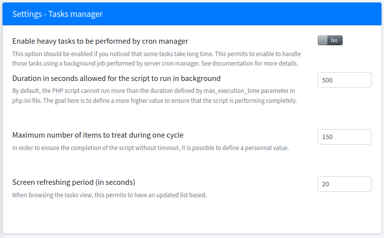

<!-- docs/settings.md -->

## Generalities

## Tasks

> Permits to handle heavy treatment using dedicated server cron job.

This option should be enabled when Teampass stores a lot of items or when the server performance are limited.
Currently implemented in case of:
* new user creation (keys encryption step)
* email sending

### Options

> You should use the options to set up the tasks management to fit your PHP server configuration.

Navigate to `Administration > Settings > Options`.

1. Set the maximum duration a script can execute in background. 
_It is suggested to define a higher value that the `max_execution_time` defined in `php.ini` file. Value `0` indicates that any time for the script is allowed._ 
2. Set the number of items will be treated by the script.
_This value is to adapt depending on what happen. But you should not change it._
3. Set the delay after which the data is refreshed in the tasks management follow up page.

### Setting up the cron job

The goal here is to define a new cron job executing a specific action at a defined frequency.

| File name | Purpose | Comment |
| --------- | ------- | ------- |
| background_tasks___user_keys_creation.php | Finalizing the user creation process | Could be performed every 5 minutes |
| background_tasks___sending_emails.php | Sending emails | Could be performed every 1 minute |

> 👉 The files are located in Teampass folder under `\scripts`.

_Note: the example provided below are based upon a Linux server based and should be adapted for other._

First you need to get the location to php (you can run `locate php`).

Then open the crons manager (`crontab -e`)
and add the input permitting the job to run each 5 minutes for example.
``*/5 * * * * /usr/bin/php /var/www/html/TeamPass/scripts/background_tasks___user_keys_creation.php``

As a consequence, the script will be run every 5 minutes. Depending on existing tasks in the backlog to run, it will handle them silently.
As an admin, you have a view permitting to see the progress status.

### Tasks management follow up page

> This page permits to get track of all tasks being performed in time and to follow the ones on-going.

Navigate to `Administration > Utilities > Tasks`.